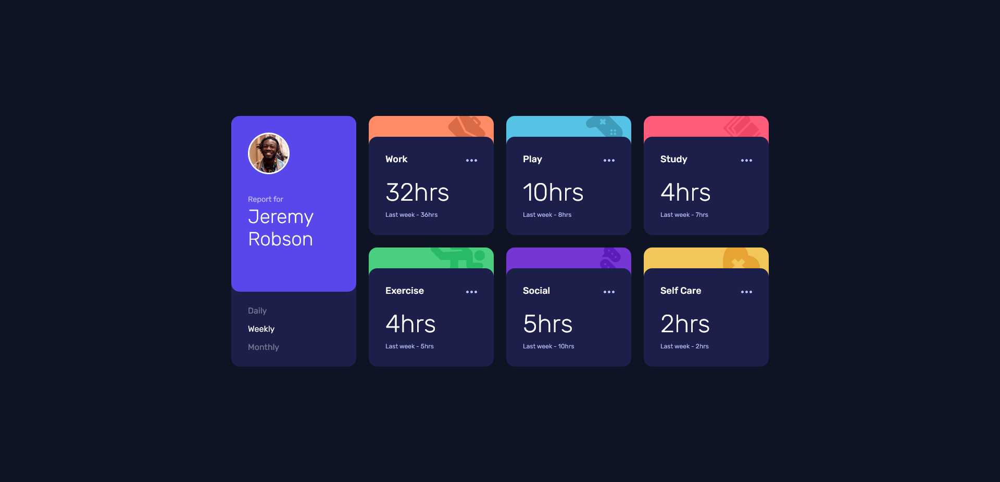

# Frontend Mentor - Time tracking dashboard solution

This is my solution for the [Time tracking dashboard challenge on Frontend Mentor](https://www.frontendmentor.io/challenges/time-tracking-dashboard-UIQ7167Jw).

## Table of contents

- [Overview](#overview)
  - [The challenge](#the-challenge)
  - [Screenshot](#screenshot)
  - [Links](#links)
- [My process](#my-process)
  - [Built with](#built-with)
  - [What I learned](#what-i-learned)
  - [Useful resources](#useful-resources)
- [Author](#author)

## Overview

### The challenge

Users should be able to:

- View the optimal layout for the site depending on their device's screen size
- See hover states for all interactive elements on the page
- Switch between viewing Daily, Weekly, and Monthly stats

### Screenshot



### Links

- [Live Site on Netlify](https://fm-time-tracking.netlify.app/)
- [Solution Page on Frontent Mentor](https://www.frontendmentor.io/solutions/time-tracking-dashboard-with-typescript-and-vanilla-web-components-PWd7hx0St)
- [Code on Github](https://github.com/Jak-Ch-ll/FM_time-tracking-dashboard)

## My process

### Built with

- [TypeScript](https://www.typescriptlang.org/)
- [Web Components](https://developer.mozilla.org/en-US/docs/Web/Web_Components)
- [Vite](https://vitejs.dev/)
- CSS custom properties
- CSS Grid
- Mobile-first approach

### What I learned

When looking at this challenge, I immediately knew that reusable components in some form would be helpful. At first, I thought about using a Frontend Framework like React or Svelte, but then I thought, why not learn something new. So I decided to look into Web Components.

It was an interesting experience and reminded me of the convenience of classic web frameworks. In many moments I thought about possible utility functions or classes around the API to improve the workflow for more complex projects. I got to understand why frameworks like [Lit](https://lit.dev/) exist and was reminded of a quote by Fireship in his [Video: I built the same app 10 times](https://www.youtube.com/watch?v=cuHDQhDhvPE): "The last thing the world needs is another JavaScript framework".

One utility function I wrote is to import components into other components. Out of the box, a web component has to be defined once via its class and then is used via the tag name, which does not provide type safety or a traceable import tree. This is what I came up with:

```ts
export type CustomElementTagName = `${string}-${string}`

export function createNode(
  elementTagName: CustomElementTagName,
  elementClass: CustomElementConstructor
) {
  // define the custom element in the DOM so it can be used
  window.customElements.define(elementTagName, elementClass)

  // return a function to create an instance of the custom element
  return () => document.createElement(elementTagName)
}
```

### Useful resources

- ['Web Components Crash Course' by Brad Traversy on YouTube](https://www.youtube.com/watch?v=PCWaFLy3VUo) - This tutorial helpd me kickstart my Web Component knowledge

## Author

- Frontend Mentor - [@Jak-Ch-ll](https://www.frontendmentor.io/profile/Jak-Ch-ll)
- Github - [@Jak-Ch-ll](https://github.com/Jak-Ch-ll)
- linkedin - [Jakob Chill](https://www.linkedin.com/in/jakobchill/)
